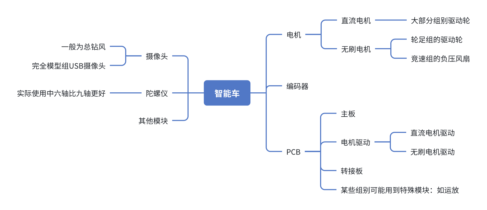
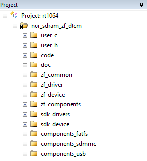
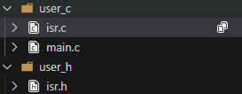
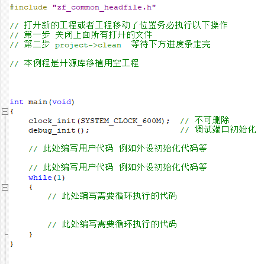
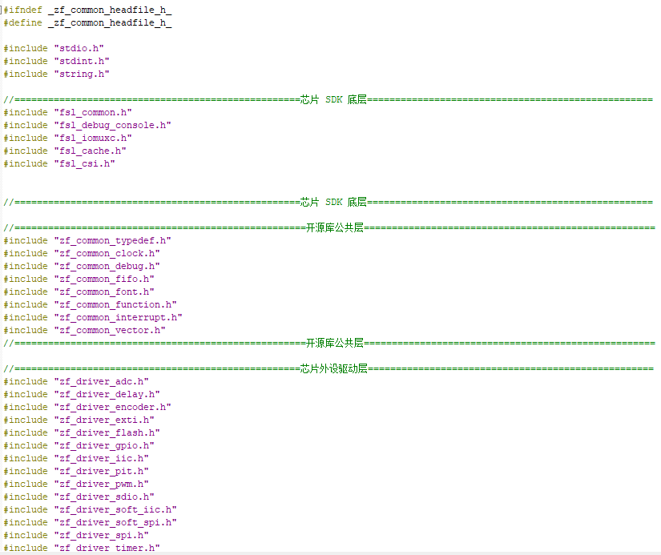
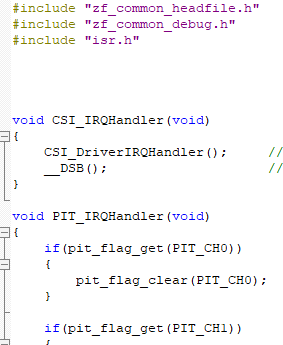
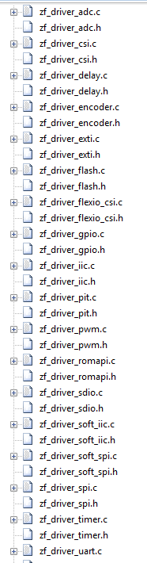
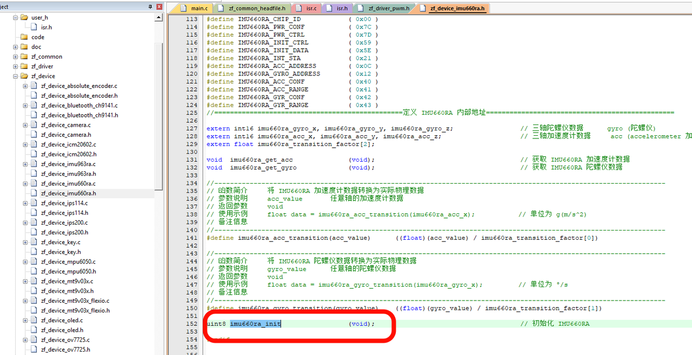

此教程为科电俱乐部智能车教学入门课程，目的是介绍，引领智能车入门与进阶

# 一、车模基本组成结构

下方为智能车硬件基本组成

大致一个三人组别推荐为一人硬件，其余两人软件。

根据每年赛题到[逐飞官网](https://gitee.com/seekfree/)下载相关资料。

逐飞官网一般都有比赛的芯片包和相关软件的下载教程

可以简要参考：

# 二、硬件

硬件部分主要基于开源方案，需根据提供的原理图，在嘉立创或AD（Altium Designer）等工具中完成PCB设计。PCB应尽量做到布局紧凑、尺寸小巧，兼顾车模安装孔位与整体质量分布的合理性。在追求小型化的同时，稳定性是首要目标。建议每年度提前规划充足时间进行硬件**稳定性测试**，并制作足量备用板卡带至赛场，以应对突发情况。

## 1、主板

主板设计前需与软件团队充分沟通，明确所需外设接口。例如，常规学习板可能提供四路编码器接口，而实际车辆仅需两路，冗余接口可予以删减。同时，应考量人机交互需求，如是否增加旋钮、按键等功能模块。

布局与布线阶段建议参考成熟开源项目，汲取设计思路与方法，注重信号完整性与抗干扰能力，避免简单照搬。

智能车主板属低速板卡，布线正确通常即可保障基本功能。

主板测试时，**务必先取下核心板**，使用学生电源检测各电源网络电压是否正常、有无局部过热。确认无异常后，再安装核心板。部分主板需核心板信号才能开启外设5V供电，此时可从主板引出3.3V信号模拟使能条件。

## 2、电机驱动

电机驱动部分为核心且调试难度较高的模块，常见方案为DRV8701直流电机驱动板。该板卡贴片焊接难度较大，建议多次练习以掌握技巧。焊接完成后需使用万用表进行通路测试，确保无虚焊、短路。

特别注意电源与驱动线路的线宽设计，满足电流承载需求，避免因线径不足引发过热或压降过大。

## 3、总体要求

每块PCB均应清晰标注学校名称、队伍标识、制作日期等基本信息，且这些信息应布置在易于识别、不影响装配及调试的位置。文字摆放应整洁美观，符合制图规范。

# 三、软件

以下代码基于20届智能视觉组Y车模讲解,以下代码全部为胡璟与王进超两位同学手搓，如有问题多多包含

## 逐飞库是什么？

Car\_code/                    # 车底盘代码

&#x20;  ├── libraries/               # 开源库文件

&#x20;  │   ├── zf\_common/          # 公共基础库

&#x20;  │   ├── zf\_driver/          # 芯片外设驱动

&#x20;  │   ├── zf\_device/          # 外接设备驱动

&#x20;  │   ├── zf\_components/      # 应用组件

&#x20;  │   ├── sdk/                # NXP官方SDK

&#x20;  │   ├── components/         # 第三方组件

&#x20;  │   └── doc/                # 文档

&#x20;  └── project/                # 工程文件

&#x20;      ├── code/               # 用户代码

&#x20;      ├── iar/                # IAR工程配置

&#x20;      ├── mdk/                # MDK工程配置

&#x20;      └── user/               # 用户自定义文件

逐飞库简而言之就是逐飞基于官方的开源库根据竞赛需求简化、针对智能车的需求二次封装的库。

这个库（以RT1064库为例）中一般包含以下内容

其中我们最需要使用的是user\_c、user\_h、code、zf\_driver和zf\_device

我们依次来介绍各个文件相关作用

首先user\_c、user\_h

在user\_c中有咱们熟悉的main.c函数，其中main处就是咱们运行代码的地方。

它的头文件zf\_common\_headfile.h值得我们注意一下，包含了芯片底层、外设等头文件，有些过分多了，所以根据自己的需求可以注释掉一些不用的头文件节省时间。

在isr.c中主要是中断回调函数，在其中做中断处理，这里是我认为最为重要的地方，一般来说所有的数据采集包括陀螺仪数据、编码器数据等带放在中断中采集，图像运算量较多就放在while中执行就好

使用逐飞库最大的一个特点就是便捷快速，以zf\_driver为例相较于stm32标准库他省去了很多配置过程

举例来说，输出一路PWM信号：

使用这一个函数就可以实现初始化一路PWM，pwm\_channel\_enum为其定义的结构体变量，需要使用哪一个管脚就直接填入相应的成员，例：pwm\_init(PWM\_Right, 17\*1000, 0);串口等配置也同样如此，

如果要使用逐飞店铺里的设备比如摄像头、屏幕陀螺仪等，配置就需要用到zf\_device中相应的设备文件，以陀螺仪为例只需要调用其中的init函数就可以了，但是需要在相应的.h中配置设备的信息，且在.h文件中会有设备读取到的相关信息：

## 1、电机

控制一个直流电机使用DRV8701这个驱动需要一路PWM信号与一路方向信号

1. **PWM初始化**：对左、后、右三个电机的PWM模块进行初始化，设置频率为17kHz，初始占空比为0，最大占空比在逐飞的zf\_driver中可以进行配置

2. **GPIO初始化**：配置电机方向控制引脚为推挽输出模式，并设置初始方向状态

通过这些配置，为电机控制系统做好硬件初始化准备。

void Motor\_Control(bool run) 这段代码放入定时中断中运行

1. **启动控制**：根据`run`参数决定是否执行PID计算

2. **停止保护**：若不运行则将所有电机占空比置零

3. **方向控制**：通过判断占空比正负来设置电机转向GPIO电平

4. **PWM输出**：根据占空比绝对值设置PWM输出，实现电机速度控制

核心是通过PID算法（此处推荐增量式PID、模糊PID）计算出的占空比值来控制三个电机的转向和转速。

## 2、编码器

为了实现电机转速稳定，需要加入编码器测速，加入PID算法控制转速稳定，由此引入编码器

逐飞店铺中含有：带方向mini编码器、360°绝对式角度位置传感器和1024正交解码mini编码器

我更推荐带方向 mini编码器&#x20;

* 初始化三个编码器模块

* **编码器1**：使用QTIMER1的通道1和2，连接引脚C0和C1（后轮）

* **编码器2**：使用QTIMER1的通道1和2，连接引脚C2和C24（左轮）

* **编码器3**：使用QTIMER2的通道1和2，连接引脚C3和C25（右轮）

通过encoder\_quad\_init函数配置正交编码器的定时器和通道引脚。

**具体配置要求看逐飞库要求**

测速需要定时测量否则毫无意义，要求将其放入定时中断中进行获取，也需要滤除一些噪声，使用RCFilter，

1. **读取编码器数据**：从三个定时器通道获取编码器计数值，取负值后分别赋给B、R、L三个方向的编码器变量

2. **RC滤波处理**：对原始编码器数据进行RC滤波，得到平滑的编码器值

3. **清零编码器计数**：将三个编码器通道的计数器清零，为下一次采样做准备

电机的PID控制一般使用增量式PID或者模糊PID

## 3、陀螺仪

陀螺仪用处在可以写惯导、辅助出入圆环条件等

初始化代码很简单

陀螺仪数据一般会涉及到零漂，温漂等，需要加入一定算法去除。这里给出我用的四元数互补滤波，

使用此代码在上点一段时间后不要碰车！！！！！

在进行去零漂操作，同样采集数据放入中断采集

## 4、摄像头

摄像头使用总钻风，获取的图像为灰度图像，对其操作主要为数组操作，代码量非常大，我主要的图像代码就快4000行左右

所以咱们需要理清楚每一步的操作。

部分说明可以点击--->[ image.c详细解释](https://xcnc1ikzqc12.feishu.cn/wiki/SufJwz9adiYMGvkyQnxcP69Pnuf)

这里推荐一些写的比较好的视频

### （1）image.c总体结构

#### 1.模块概述

`image.c` 是智能车项目中核心的图像处理模块，负责处理摄像头采集的图像数据，实现赛道识别、边界检测、元素识别等功能。

#### 2.主要数据结构

##### ①图像数组

##### ②边界线数组

##### ③特征点存储

#### 3.核心处理流程

##### ① 图像预处理

* **大津法阈值计算** (`otsuThreshold`) - 自适应阈值分割

* **二值化处理** (`turn_to_bin`) - 将灰度图转为黑白图

* **形态学滤波** (`image_filter`) - 膨胀腐蚀操作去除噪声

* **边缘绘制** (`image_draw_rectan`) - 绘制图像边框

##### ②边界检测算法

* **八邻域搜索** (`search_l_r`) - 核心边界追踪算法

  * 顺时针搜索左边界，逆时针搜索右边界

  * 使用种子点进行区域生长

  * 记录边界点和生长方向

* **边界提取** (`get_left`, `get_right`) - 从点集中提取边界线

##### ③特征检测

###### 拐点检测

* **下拐点检测** (`get_down_turning_point`) - 检测赛道下弯处

* **上拐点检测** (`get_up_turning_point`) - 检测赛道上弯处

* **角点检测** (`get_turning_point`) - 综合拐点检测

###### 特殊元素识别

* **十字路口识别** (`Cross_fill`) - 十字路口补线处理

* **圆环识别** (`Island_Detect`, `circle_test`) - 圆环赛道处理

* **斑马线识别** (`Zebra_Stripes_Detect`) - 起跑线检测

##### ④边界补线策略

* **直线补线** (`Left_Add_Line`, `Right_Add_Line`) - 基于两点连线

* **斜率补线** (`K_Add_Boundry_Left`, `K_Add_Boundry_Right`) - 基于斜率延长

* **边界延长** (`Lengthen_Left_Boundry`, `Lengthen_Right_Boundry`) - 基于趋势延长

#### 4.关键算法特点

##### 1. 八邻域搜索算法

* 使用8个方向的邻域点进行边界追踪

* 左边界顺时针搜索，右边界逆时针搜索

* 实时记录生长方向，用于后续分析

##### 2. 拐点检测策略

* 基于向量夹角计算判断拐点

* 使用连续多个点进行角度分析

* 区分上下拐点，用于不同场景识别

##### 3. 丢线处理机制

* 统计左右边界丢线数量

* 根据丢线情况采取不同补线策略

* 支持单边丢线和双边丢线处理

##### 4. 元素状态机

* 圆环识别使用6状态状态机

* 十字路口识别使用多种补线模式

* 元素间互斥处理，避免误识别

#### 5.输出结果

* **中线误差** (`Line_Error`) - 用于PID控制的路径偏差

* **元素标志** (`Image_Flag`) - 识别到的赛道元素状态

* **边界线数据** - 用于显示和进一步处理

#### 6.模块依赖关系

* 依赖 `mt9v03x_image` 摄像头原始数据

* 调用 `Cal_Weigth()` 计算中线误差

* 与 `car_control` 模块交互传递控制信息

该模块实现了完整的图像处理流水线，从原始图像到可用的控制信息，是智能车视觉导航的核心组件。

### （2）参数配置

基本都在 zf\_device\_mt9v03x.h 文件中，主要涉及到引脚配置、图像的大小、曝光、帧率偏移等，一般60帧已经满足控制要求了，但我用RT1064主频600M就随便用了，这部分建议写好屏幕交互，快速使用界面，以免在赛场上出问题。

### （3）初始化代码

在初始化之前把配置先写好在初始化。

根据逐飞库分析代码得知，运行初始化过后有两个重要数据：

一个是一帧图像采集完成标志位，另一个数组就是图像数组，我们图像做的就是对这个数组进行操作与获取信息。

该流程主要是将从总钻风获取的灰度图像转为二值化图像

#### 1.大津法动态获取阈值

此处直接使用即可，了解其中的数学方法即可

大津法自动计算图像二值化阈值的函数，它通过统计图像灰度直方图，遍历所有可能的阈值并计算对应的类间方差，最终选择使前景和背景区分度最大的阈值作为最佳分割点。该算法首先统计各灰度级像素数量，然后基于概率计算每个阈值对应的前景背景分离程度，通过最大化类间方差来确定最优阈值

#### 2.转为二值化图像

使用大津法自动计算阈值并将灰度图像转换为二值图像。函数首先调用`otsuThreshold`函数计算出最佳阈值，然后遍历图像的每个像素，将灰度值大于阈值的像素设为白色（255），小于等于阈值的像素设为黑色（0），最终生成二值化图像存储在`bin_image`数组中

#### 3.图像基础滤波

基于邻域统计的图像滤波函数，它通过分析每个像素周围8个邻域像素的数值来优化二值图像质量：当黑色像素周围的白点数量超过设定上限时将其变为白点以填补空洞，当白色像素周围的白点数量低于设定下限时将其变为黑点以消除噪声，从而实现类似形态学膨胀和腐蚀的平滑效果，有效去除孤立噪点并连接断裂边缘。

#### 4.图像画框

由于部分情况会使得图像巡线代码出错卡死，对图像预先进行操作，

#### 5.图像操作（补充）

对图像进行画框其实就是一种直接对图像的便捷操作，此处补充图像两点画线操作函数

#### 6.图像逆透视处理（补充）

直接获取的图像为镜头处人眼看到的图像，可以通过透视变换实现一个上帝视角（俯视图）的操作

此处直接补充，请自行探索，理论上限更高

#### 7.寻找边界（八邻域）

常见的找边界方法有逐飞开源的差比和，最长白列，八邻域与上交大Autop的左右手法则

此处列出我融合最长白列与八邻域算法，提升空间还很大

##### ①寻找起点seed

get\_start\_point(uint8 start\_row)函数从图像中间列向左右两侧扫描，分别寻找左侧和右侧的赛道边界点：左侧边界点为白点(255)且其左侧为黑点(0)的位置，右侧边界点为白点(255)且其右侧为黑点(0)的位置。如果成功找到左右两个边界点，则设置相应标志位并返回1表示成功，否则返回0表示未找到完整起点

##### ②八邻域提取边线

八邻域基本代码流程：搜索的图像边界追踪函数，通过同时从左右两个起点出发，按照顺时针和逆时针方向分别追踪边界点，在每次循环中处理左右各一个像素点，通过检测当前点为黑而相邻点为白的边缘特征来识别边界，并根据纵坐标优先的原则选择下一个追踪点，当左右边界相遇或连续三个点坐标相同时终止追踪，最终记录相遇点的高度信息。

##### ③提取边线

根据八邻域提取出的数组进行取线操作，实现每一行只有一个点

此方法简单,但存在一定bug，自行修改

#### 8.最长白列检测

首先初始化统计数组并清零历史数据，然后从图像底部向上扫描每一列，计算从底部开始的连续白色像素长度（遇到特定白-黑-黑-白模式时停止计数），最后分别从左到右和从右到左遍历所有列，找到左右两侧具有最长连续白色像素的列并记录其长度和位置信息。

#### 9.丢线检测

用于检测图像中左右边界线的丢失情况，其流程可概括为：首先初始化丢失计数器和标志数组，然后遍历图像每一行，当左边界线过于靠近左边缘或右边界线过于靠近右边缘时标记该行为丢失状态并计数，最后根据左右边界丢失的行数判断整体丢失情况，返回不同的状态码（0正常、1双边丢失、2左边丢失、3右边丢失）。

#### 10.未完待续。。。

## 5、PID

在智能车中PID应用非常多，尤其是在我的这个组别中尤其多，PID算法多达十余处

PID的文章我个人认为这篇较好：

此处仿真在电脑上更好，有教程模式帮助你理解pid功能：

到实际应用中概括可以将误差输入这个系统，将输出给到控制器形成闭环反馈，此处给出增量式、位置式以及模糊PID，此外补充一个角度环示例代码

### （1）增量式PID

### （2）位置式PID

### （3）模糊PID

### （4）角度环示例

## 6、循迹

### （1）拟合中线

由于边线的突变会导致中线也发生突变，破坏高速下的稳定性，由此对中线进行滤波操作

### （2）权重计算误差

## 7、元素

### （1）拐点判断

此处给出两种判断方法，但实际比赛时我使用第一种。两者判断依据不同，撕裂法是使用边线横向间隔判断。向量法使用八邻域边线向量法判断角度。

#### ①撕裂法

#### ②向量法

### （2）斑马线

判断依据为多个黑白跳变判断斑马线

### （3）十字

判断依据：含有多个拐点且左右丢线，那么进行相应布线操作

### （4）圆环

判断依据：含有下拐点，圆环中拐点，一侧丢线，另一侧直线则进行圆环操作

## 8、补充

### （1）Canny边缘检测

### （2）惯导部分代码

### （3）条件定时函数

需要在中断中添加

### （4）蜂鸣器

中断中添加

### （5）屏幕补充函数

# 四、参考资料

**C车机械：**

链接：https://pan.baidu.com/s/10skXXwS4DlLT0LpUPiK4vw&#x20;

提取码：5xko&#x20;

\--来自百度网盘超级会员V6的分享

来自

[【散贡献】智能车机械安装视频教程：C车模舵机改装\_恩智浦(飞思卡尔)智能车竞赛\_智能车制作 - Powered by Discuz! (znczz.com)](http://www.znczz.com/thread-227387-1-1.html)

&#x20;

&#x20;

**C车差速：**

1.[C车双电机差速方法！！\_恩智浦(飞思卡尔)智能车竞赛\_智能车制作 - Powered by Discuz! (znczz.com)](http://www.znczz.com/thread-29777-1-1.html)

链接：

<http://www.znczz.com/thread-29777-1-1.html>

&#x20;

2.[【新提醒】c车电子差速那点事儿……曾经的西科4队差速策略\_往届赛事讨论\_智能车制作 - Powered by Discuz! (znczz.com)](http://www.znczz.com/forum.php?mod=viewthread\&tid=233746)

链接：

<http://www.znczz.com/forum.php?mod=viewthread&tid=233746>

&#x20;

&#x20;

**上位机**(这个帖子的没多大用但是看看比较好用来理解图像)：

[【新提醒】新手入门摄像头-第一篇:智能车摄像头上位机的使用\_恩智浦(飞思卡尔)智能车竞赛\_智能车制作 - Powered by Discuz! (znczz.com)](http://www.znczz.com/forum.php?mod=viewthread\&tid=110783\&extra=page=2)

链接：

<http://www.znczz.com/forum.php?mod=viewthread&tid=110783&extra=page%3D2>

&#x20;

**SD卡存图：**

[【新提醒】SD卡记录摄像头的一些坑和最终办法\_恩智浦(飞思卡尔)智能车竞赛\_智能车制作 - Powered by Discuz! (znczz.com)](http://www.znczz.com/forum.php?mod=viewthread\&tid=280866\&extra=page=10)

链接：

http://www.znczz.com/forum.php?mod=viewthread\&tid=280866\&extra=page%3D10

&#x20;

**图像矫正：**

1[【新提醒】关于桶形失真的矫正\_恩智浦(飞思卡尔)智能车竞赛\_智能车制作 - Powered by Discuz! (znczz.com)](http://www.znczz.com/forum.php?mod=viewthread\&tid=78931\&extra=page=6)

链接：

http://www.znczz.com/forum.php?mod=viewthread\&tid=78931\&extra=page%3D2[【新提醒】【经验分享】逆透视变换的一种方法\_往届赛事讨论\_智能车制作 - Powered by Discuz! (znczz.com)](http://www.znczz.com/forum.php?mod=viewthread\&tid=239510)

链接：

<http://www.znczz.com/forum.php?mod=viewthread&tid=239510>

&#x20;

&#x20;

&#x20;

&#x20;

**控制方面：**

**&#x20;**

1[【新提醒】乐师摄像头控制算法分享。\_恩智浦(飞思卡尔)智能车竞赛\_智能车制作 - Powered by Discuz! (znczz.com)](http://www.znczz.com/forum.php?mod=viewthread\&tid=101058\&extra=page=2)

链接：

<http://www.znczz.com/forum.php?mod=viewthread&tid=101058&extra=page%3D2>

&#x20;

2[【新提醒】【脑洞】很渣渣的摄像头C车经验散尽\_往届赛事讨论\_智能车制作 - Powered by Discuz! (znczz.com)](http://www.znczz.com/forum.php?mod=viewthread\&tid=239292)

链接：

<http://www.znczz.com/forum.php?mod=viewthread&tid=23929>

&#x20;

1. [【新提醒】倾情奉献， 两年渣渣散经验\_往届赛事讨论\_智能车制作 - Powered by Discuz! (znczz.com)](http://www.znczz.com/forum.php?mod=viewthread\&tid=264685)  (东西很多)

链接：

<http://www.znczz.com/forum.php?mod=viewthread&tid=264685>

&#x20;

4\.

[【新提醒】西部前十，无缘国赛，思路分享\_往届赛事讨论\_智能车制作 - Powered by Discuz! (znczz.com)](http://www.znczz.com/forum.php?mod=viewthread\&tid=282302)

链接：

<http://www.znczz.com/forum.php?mod=viewthread&tid=282302>

&#x20;

5\.

[【新提醒】【经验贴】【感谢贴】【长文】3m小车比赛失误散尽经验回家考研\_往届赛事讨论\_智能车制作 - Powered by Discuz! (znczz.com)](http://www.znczz.com/thread-221351-1-1.html)

链接：

<http://www.znczz.com/thread-221351-1-1.html>  和

<http://www.znczz.com/thread-221388-1-1.html>

璟
