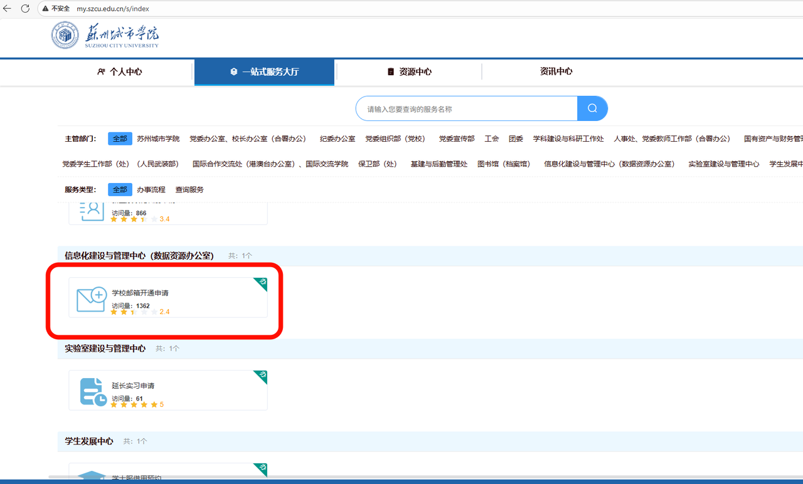

# 一、简述

作为一名22级电子相关专业的本科生，大学这三四年里，我把大部分时间都投入在了专业学习和竞赛中。这一路走来，遇到的困难不少，尤其是当问题卡壳、又无人指引的时候，那种迷茫和焦虑格外煎熬。但好在坚持下来了，每次看到努力终于换来结果，心里还是挺欣慰的。

我曾和不少学弟学妹交流过前景、学习和生活方面的困惑。其实我自己原本性格偏内向，学习路上也得到过一些学长的帮助，虽然不多，更多时候还是靠着自己查资料、规划路线，一步步摸索前进。现在回看这段经历，我常想，如果大一的时候能有一位学长帮我理清方向，告诉我什么时候该做什么、该学什么，那该多好。

所以我想，不如现在就粗略地分享一下自己的学习路线，希望能对正在这条路上前行的你有所帮助。仅代表个人路线，还需根据自己的兴趣去学习。

# 二、分类

想象一个任务：让一个机器人自主行走并完成特定工作。要实现它，我们需要哪些知识？这个复杂问题可以拆解为几个核心部分：如何让它“看懂”和“思考”？如何让它“感知”并“驱动”？如何设计它的“身体”以保证稳定？这些问题正对应着电控、硬件和机械这三个核心领域。

电控，核心是“编程”和“逻辑”。它关注的是如何通过代码和算法，让计算机或处理器去执行特定的任务、实现预定的功能。小到点亮一个LED灯的程序，大到复杂的数据处理、图像识别或人工智能算法，都属于软件的范畴。掌握了软件，你就能为系统注入“智能”和“思维”。

硬件，核心是“电路”与“信号”。它关注的是系统的物理构成，包括电路设计、元器件选用、信号处理和接口通信等。从设计一块具体的电路板，到确保传感器信号能准确读取、电机能可靠驱动，都是硬件工作的关键。掌握了硬件，你就是在搭建整个项目的“身体”与“骨骼”。

机械，核心是“结构”与“运动”。它关注的是物体的物理形态、结构强度、运动方式以及如何与外部环境交互。比如，设计一个稳固的机器人底盘、一个可靠的机械臂传动机构，或是一个轻量化的无人机机身。掌握了机械，你就是在塑造产品的“形体”并赋予其“运动”的能力。

# 三、电控

从我个人的竞赛经历来看，大学里常说的“电控”其实可以细分为几个不同的技术方向，其中比较核心的有嵌入式软件、视觉处理和上位机开发三大块。

## (1)嵌入式软件

嵌入式软件，可以说是整个电控系统的“底层指挥官”。它主要负责直接与硬件芯片打交道，编写运行在微控制器（比如STM32）上的固件程序，实现对电机、传感器、执行机构的精准控制。这个方向要求你对硬件寄存器、时序、中断等有清晰的理解，核心是用C/C++等语言让芯片按你的逻辑高效运行。

嵌入式软件是基本是每个人入门的地方，下面着重说一下学习路线

### 0、编程语言

* 核心定位：这是所有嵌入式开发的前提，是你向硬件芯片下达指令的唯一工具。

* 学习内容：

  * C语言：这是嵌入式开发的绝对主流和基石。你必须牢固掌握：指针、结构体、内存管理、位运算、宏定义等核心概念。这些是直接高效操作硬件寄存器、理解数据在内存中布局的关键。

  * C++：在复杂项目中，C++ 因其面向对象特性（封装、继承、多态）和强大的模板库（如STL），能更好地组织代码，提高开发效率和可维护性。对于需要复杂算法或架构的大型嵌入式应用尤为重要。

  * 汇编（很难直接读懂）：这是最接近硬件底层的“机器语助记符”。它让你能直接操控CPU的寄存器、精确管理内存地址、控制每一个指令周期。

* 学习价值：熟练掌握C/C++，就如同学会了与硬件芯片沟通的“母语”。无论后续面对哪种单片机，你都能快速上手，将你的逻辑思维转化为机器可执行的精确指令。

学习新的编程语言推荐b站，或者菜鸟教程

### 1、51单片机

* 核心定位：它是绝大多数人的入门芯片，以其简洁的架构带你理解计算机最基础的工作原理。

* 学习内容：你将第一次接触并亲手操作GPIO（通用输入输出）、定时器、中断、串口（UART） 这些嵌入式概念。通过它，你能学会用C语言点亮LED、驱动数码管、读取按键，实现最基础的人机交互。

* 为何从此开始：其资源有限、结构经典，能让你摆脱复杂硬件的干扰，专注于理解“程序如何控制硬件”这一核心思想，是建立自信和培养硬件思维的最佳起点。帮助你从寄存器层面了解掌握单片机的工作原理，同时巩固c语言基础。

推荐江协科技的51和STM32的课程

### 2、STM32

* 核心定位：从51过渡到STM32，是从“理解原理”到“实战应用”的关键一跃，它是目前竞赛和工业领域应用最广泛的微控制器之一。

* 学习内容：你将接触到基于ARM Cortex-M的32位内核，并学习两种开发模式：标准库（HAL库） 与寄存器开发。重点是掌握更复杂的外设，如多种定时器的高级应用、ADC/DAC（模数/数模转换）、I2C、SPI通信协议等。

* 关键跨越：在这里，你将从“逐个配置寄存器”转向学习使用“库函数”来高效开发，并开始构建多任务程序的框架思维，为实时操作系统（RTOS）的学习打下基础。

### 3、esp32

* 核心定位：在掌握了基础控制后，ESP32为你打开了“物联网（IoT）”的大门。

* 学习内容：它的核心价值在于集成了Wi-Fi和蓝牙功能。你可以学习如何让设备接入局域网或互联网，实现手机App控制、MQTT协议通信、访问云平台等。它让你做的项目从“单机”走向“互联”。对于某些自由发挥命题比较友好。

* 能力拓展：它标志着你的技能从单纯的硬件控制，延伸到了网络通信领域，项目创意和可实现的范围得到了巨大拓展。

### 4、MSP单片机

* 核心定位：由德州仪器（TI）推出，尤其在低功耗领域表现出色，但是性能一般，不易开发，电赛必学。外设资源少的可怜

* 学习内容：接触它与之前芯片不同的架构（如16位的MSP430），并深入理解如何从芯片设计层面实现超低功耗。这对于电池供电、需要长期待机的设备（如某些传感器节点、便携仪器）至关重要。

* 学习价值：它能让你意识到，不同的应用场景需要选择不同特点的芯片，并帮助你建立“功耗”这一重要的产品化设计思维。

推荐苏大的同学做的课程

### 5、国产单片机

* 核心定位：近年来迅速崛起的强大力量，如GD32（兆易创新）、CH32（沁恒）等，它们通常与STM32硬件兼容，形成了极具性价比的替代方案。

* 学习内容：在学习STM32的基础上，快速上手一款国产芯片，了解其生态、开发工具和可能存在的差异。这些单片机在比赛的特定赛道中会遇到。

* 现实意义：掌握它们能让你紧跟行业趋势，在未来的项目或工作中，具备根据成本、供货等因素灵活选型的能力。我还是比较推荐国产的芯片，但是国内的社区环境不太好，有些厂商直接把STM32的东西搬过来BUG很多。

推荐到CSDN上自行寻找

### 6、FPGA

* 核心定位：这已经超出了传统单片机的范畴，是一次思维模式的跃升。它不再是通过软件顺序执行指令，而是通过硬件描述语言（如Verilog）“搭建”数字电路。

* 学习内容：学习并行思维、时序逻辑，并实现如高速数据采集、并行图像处理、自定义通信协议等对实时性和并行处理能力要求极高的功能。

* 能力巅峰：掌握FPGA，意味着你能够从最底层设计专用硬件电路，来解决软件流程无法满足的极致性能需求，是嵌入式工程师向更高阶发展的重要方向。

### 7、其他

除了上述主线，还有像树莓派（可视为微型电脑，侧重Linux应用开发）、DSP（专用于数字信号处理）等平台。这条学习路径的本质是：从控制一个引脚，到协调一个复杂系统，再到设计专用硬件。建议每一步都扎实打好基础，通过实际项目去消化理解，你的能力便会在这条路径上稳步提升。

### 8、FreeRTOS(推荐学习)

当你的嵌入式项目从单一任务升级为需要同时处理多个任务（如同时控制电机、读取传感器、进行无线通信）时，传统的“超级循环”前后台架构就会变得力不从心。这时，FreeRTOS 作为一个轻量级的实时操作系统，就扮演了“系统大脑”的角色，负责协调和管理所有任务。

1. 核心定位：任务的“调度大师”

FreeRTOS 的核心价值在于它的实时任务调度器。它让你可以将一个复杂的应用程序分解成多个独立的、轻量级的“任务”（可以理解为线程），每个任务负责一个特定的功能。调度器会根据优先级自动、快速地在这些任务之间切换，创造出一种“多个任务在同时运行”的假象，从而极大地提升了 CPU 的利用率和系统的响应能力。

* 关键机制：任务间的“沟通桥梁”

单个任务不足以构成一个系统，任务之间的信息同步与数据传递更为关键。FreeRTOS 提供了丰富的通信机制，充当任务间的“协调员”：

* 队列：任务间安全传递数据的主要方式，避免了全局变量带来的数据冲突风险。

* 信号量：用于控制对共享资源（如串口、SPI总线）的访问，实现高效的互斥与同步，是解决资源竞争问题的关键。

* 任务通知：一种轻量级的、快速的信号传递机制，适用于高效率的线程间同步。

- 学习价值：从“裸机”思维到“系统”思维

学习 FreeRTOS 远不止是学习一个软件库，它代表着嵌入式开发思维的一次重要跃升：

* 应对复杂项目：它是开发复杂嵌入式应用（如物联网设备、无人机飞控、工业控制器）的基石。

* 提升代码质量：通过任务划分和资源管理，促使你的代码结构更清晰、模块化更强、更易于维护。

* 行业必备技能：FreeRTOS 因其开源、免费和高度可移植的特性，已成为全球嵌入式领域应用最广泛的实时操作系统之一，是迈向中级嵌入式工程师的必经之路。

### 9、FOC

FOC（磁场定向控制）是一种先进的高效电机控制技术，它通过精确地控制三相电机中产生磁场的电流方向和大小，像“驾驭一匹烈马”那样实现对电机转矩和转速的精准调节。这种方法能将复杂的三相交流电分解为独立的磁场生成电流（直轴Id）和转矩生成电流（交轴Iq），从而让电机运行起来非常平稳、安静且高效，彻底解决了传统控制方式在低速抖动和高速无力等方面的痛点

## (2)视觉

视觉处理，则像是为系统装上了“智慧的眼睛”。它主要利用摄像头采集图像，通过算法进行识别、追踪或测量。比如，让机器人识别特定的物体、跟随指示线行走，或者判断目标的位置和姿态。这个方向通常需要掌握OpenCV等库，并熟悉基本的图像处理算法和机器学习模型，编程语言以Python、C++为主。

### 1、视觉模块

当需要快速为一个小型嵌入式设备（如智能小车或无人机）赋予视觉能力时，OpenMV、K230或MaixCam等这类专门的视觉模块是绝佳的起点。

* 核心定位：它们本质上是将摄像头、处理器和预置的开发环境集成在一起的嵌入式相机，其软件和硬件都为视觉任务做了优化，让你能避开复杂的底层驱动和环境配置，专注于算法逻辑的实现。他们主控大多是高性能的单片机如STM32H7系列等，如openmv是国外的开源项目，有兴趣可以学习一下源码，国内的星瞳科技是代理商，不建议购买，价格太高！

* 特点与价值：

  * OpenMV：以其用户友好的IDE和丰富的示例代码著称，非常适合初学者。它使用类似于Python的MicroPython进行编程，可以轻松实现颜色追踪、人脸检测、二维码识别等功能。

  * MaixCam：性能更强大，内置高性能AI芯片，其核心优势在于能够直接在端侧运行轻量化的深度学习模型，为在资源受限的设备上实现复杂的AI视觉应用提供了可能。

* 学习意义：从视觉模块入手，可以让你以最低的代价和最少的软硬件困扰，快速体验到视觉应用的完整流程，建立直观的感受，是理想的入门实践平台。

### 2、OpenCV

无论使用何种硬件，OpenCV 都是你必须掌握的软件核心。它是一个开源、跨平台的计算机视觉库，提供了超过2500种算法，堪称视觉领域的“标准答案”和“瑞士军刀”。

* 核心定位：视觉开发中最基础、最通用的软件库。它屏蔽了底层细节，让你能够通过调用简单的函数来完成复杂的图像处理任务。

* 核心功能：

  * 图像基本操作：读写图片、视频流捕获、图形绘制。

  * 图像预处理：滤波去噪、灰度化、二值化、形态学操作、边缘检测等，旨在提升图像质量，为后续分析提取特征。

  * 特征提取与分析：寻找角点、轮廓、识别特定的视觉标记（如AprilTag）。

  * 传统目标识别与追踪：通过模板匹配、光流法等算法实现。

* 学习路径：建议从 OpenCV-Python 开始学习，因为Python语法简洁，能让你快速验证想法。在算法需要部署到对性能要求极高的嵌入式平台时，再转向 OpenCV C++ 进行优化。

### 3、YOLO

当传统算法在复杂场景（如多目标、遮挡、光照变化）下表现不佳时，基于深度学习的目标检测模型便展现出巨大优势。其中，YOLO 系列模型因其在速度和精度上的卓越平衡，已成为嵌入式视觉领域的首选。

* 核心定位：一种先进的、能够进行实时、端到端目标检测的深度学习框架。

* 核心思想与优势：“你只看一眼”。与传统的滑动窗口检测不同，YOLO将目标检测视为一个回归问题，只需单次前向传播即可预测出图像中所有目标的位置和类别，因此速度极快，非常适合需要实时响应的比赛场景。

* 开发流程：

  1. 数据准备：收集成百上千张任务相关的图片，并进行精细的标注。

  2. 模型训练：在拥有GPU的电脑上（CPU也行，就是可能训练到地老天荒），使用标注好的数据对YOLO模型进行训练，使其学习到目标的特征。

  3. 模型部署与优化：将训练好的模型通过特定的推理引擎转换为特定硬件支持的格式，并部署到嵌入式设备上运行。

* 学习价值：掌握YOLO，意味着你能够解决传统方法难以处理的复杂视觉问题，是视觉能力从“基础”走向“先进”的关键标志。

视觉处理的学习是一条清晰的进阶路径：你可以从 OpenMV/MaixCam 这类集成模块快速上手，建立直观认知；同时深入学习和应用 OpenCV 这一核心工具库，打下坚实的图像处理基础；最终，在面对更复杂的挑战时，引入 YOLO 等深度学习模型，解锁更强大的视觉感知能力。这条路径由易到难，理论与实践结合，能帮助你稳步构建起强大的机器视觉技术栈。

## (3)上位机

上位机开发，其核心角色是构建一个能与我们上文讲的下位机（嵌入式设备）进行通信与交互的“指挥中心”。它通过在PC、手机或像树莓派这样的高性能嵌入式平台上开发图形化软件，实现发送控制指令、接收传感器数据、进行数据可视化（如绘制实时曲线）、参数调试和日志保存等一系列关键功能。一个强大的上位机，能让你从复杂的底层代码中抽身，以更高维度的视角去监控、调试和优化整个系统。

前提是我们要学会linux操作系统

### 1. 直接通信与图形化界面

对于逻辑相对简单、主要目的在于监控和基础调试的项目，可以直接使用各种编程框架来开发上位机。

* 核心任务：建立稳定的通信链路（如串口、TCP/IP网络），并设计直观的图形用户界面。

* 常用技术栈：

  * Python：凭借其丰富的库，是快速原型开发的绝佳选择。例如，使用 `PyQt`/`Tkinter` 构建界面，使用 `PySerial` 进行串口通信，使用 `Matplotlib` 实现数据可视化。

  * C#：凭借强大的 `WinForms` 或 `WPF` 界面开发能力和 `.NET` 生态，非常适合开发运行于Windows平台的高性能、高颜值桌面应用。

  * Qt (C++)：一款跨平台的C++图形用户界面库，兼具C++的高性能和一次开发、多平台部署的优势，在工业界应用广泛。

### 2. ROS(尤其推荐)

当你的项目进化到包含多个传感器、多个执行单元，并且需要复杂的感知、决策和任务协调时（例如，一个集成了视觉、导航和机械臂控制的自主移动机器人），ROS 就成为几乎不可或缺的核心框架。ROS甚至可以直接仿真，不需要实物就可以验证代码，0成本

* 核心定位：ROS并非传统意义上的操作系统，而是一个运行在Linux（常见于树莓派、Jetson等平台）之上的分布式通信中间件和生态系统。它为你提供了一套标准化的通信机制和功能模块，让你能像搭积木一样构建复杂的机器人系统。

* 核心概念与价值：

  * 节点：每个独立的功能模块（如“视觉识别节点”、“电机控制节点”）都是一个节点，它们可以独立编写、编译和运行。

  * 话题：节点之间通过“话题”来传递数据（如视觉节点将识别到的目标位置发布到 `/target_position` 话题上，而导航节点则订阅该话题以获取信息）。这种发布/订阅模型实现了节点间的解耦，让系统架构清晰且易于扩展。

  * 服务：另一种请求/响应式的同步通信机制，适用于需要确认结果的指令，如请求相机进行一次拍照并返回结果。

* 与视觉和树莓派的结合：ROS的强大之处在于其丰富的生态。你可以轻松地启动一个ROS节点来驱动摄像头，然后使用ROS版本的OpenCV或YOLO进行视觉处理，处理结果会以标准消息的形式发布给其他节点。树莓派 因其兼具一定的计算能力和嵌入式特性，成为在中小型机器人项目中运行ROS主节点的理想平台，负责传感器数据融合、高级决策与任务调度，再通过ROS与下位的STM32等单片机进行指令交互。

总结而言，上位机与系统集成的技术选型，直接取决于项目的复杂度：

* 对于单一设备监控与调试，从 Python或C# 开始，打造一个轻量级的专用上位机是最高效的选择。

* 对于复杂的多模块智能机器人系统，则必须学习并运用 ROS，在 树莓派 这类平台上构建一个分布式、模块化、易于维护和扩展的“机器人大脑”。

ROS有很多老师讲的都很好：

# 四、硬件

硬件是嵌入式系统的物理基石，它决定了项目的性能边界、稳定性与可靠性。掌握硬件开发，意味着你不仅能编写代码，更能亲手设计和打造承载这些代码的“身体”。这条学习路径，是一个从理论验证到物理实现的全过程。

硬件讲究一个经验，多看多学多画多发现问题。

## (1)仿真

在将任何一个元件焊接到电路板之前，电路仿真 是你不可或缺的第一道安全防线。

* 核心定位：它是在计算机上构建的“虚拟实验室”，让你能够基于数学模型，模拟和分析电路的性能，提前发现设计缺陷。

* 常用工具与价值：

  * Multisim / Proteus：这类软件提供了直观的图形化界面和丰富的元器件库，非常适合进行模拟电路、数字电路的原理验证和基础调试。你可以在软件里连接电源、示波器，观察信号波形，确保电路逻辑正确，从而极大降低烧毁元件的风险和成本。

* 学习意义：仿真是将电路理论知识与工程实践连接起来的桥梁，它能帮助你建立对电路行为的深刻直觉，是硬件工程师必须掌握的基本素养。

## (2)PCB设计

当电路原理通过仿真验证后，下一步就是将其转化为可以指导生产的印制电路板文件，这个过程就是 PCB设计。

* 核心定位：它是在软件中规划电路板物理形态的过程，包括元件布局、信号走线、电源分配和电磁兼容性考虑，是硬件开发中最具艺术性和技术性的环节之一。

* 核心流程与工具：

  1. 原理图设计：使用 Altium Designer, KiCad 或 立创EDA 等工具，绘制电路的逻辑连接图。推荐国产软件嘉立创EDA，可以比较方便的一站式制版，包括画板、选材、下单，每个月两次免费打样不可错过哦。AD功能更完善，bug少，但是不太方便。

  2. PCB布局与布线：在软件中，根据原理图在虚拟的电路板上摆放元器件，并根据电气规则（如线宽、间距）连接所有信号。这就像在规划一座微缩城市，需要合理规划“道路”（导线），让“能量和信息”（电流与信号）高效、无干扰地流通。

* 学习价值：掌握PCB设计，意味着你获得了将任意电路创意转化为专业级实体产品的核心能力。嘉立创 等平台提供的快捷打样服务，使得个人学生也能以极低的成本，在几天内获得自己设计的精美电路板，极大地提升了实践的可能性。

## (3)焊接与调试

拿到制作好的PCB空板后，你需要通过焊接将元器件装配上去，并通过调试来确保硬件功能正常。

* 这是理论与实践碰撞最激烈的阶段，是将设计转化为实物的动手环节，也是检验你设计质量和解决问题能力的试金石。小心爆炸、危险（doge

* 关键技能：

  * 焊接技术：从基础的贴片元件、直插元件焊接，到使用热风枪焊接QFP等精密芯片。

  * 调试能力：当电路板不工作时，你需要借助 万用表、示波器、逻辑分析仪 等工具，像侦探一样循着信号线索，排查是短路、开路、虚焊还是设计错误，并最终解决问题。

* 学习意义：这个过程能培养你严谨的工程态度和强大的动手与问题解决能力。一个成功的硬件项目，必然是“优秀设计”与“精湛工艺”的结合。

硬件开发的完整路径环环相扣：从电路仿真开始进行理论与逻辑验证；再到 PCB设计，将优化的方案转化为可生产的精密图纸；最后通过焊接与调试，将图纸变为稳定运行的实体。这条路径让你得以从零开始，完整地创造出一个可靠的硬件平台，为你所有的软件与算法提供最强健的躯体。

焊接没有好的教程，自己多焊就找到感觉了

# 五、机械

机械是项目构思在三维空间中的具象表达，它决定了产品的物理形态、结构强度与运动功能。掌握机械设计，意味着你不仅能实现电路的智能和代码的逻辑，更能为它打造一个坚固、高效且可靠的“身体”。好的机械设计在项目中真的事半功倍，这在电赛中尤其重要。

## (1)SOLIDWORKS / Fusion 360

当概念确定后，就需要使用专业的工程软件来构建精确的、包含制造信息的模型，在设计中一定要遵守规则，实用优先，美观在后。

* 核心定位：这是机械设计的核心环节，旨在创建参数化模型，定义零件的精确尺寸、材料、装配关系，并检查干涉，最终生成可用于生产的工程图。

* 核心工具与流程：

  * SOLIDWORKS / Fusion 360：这两者是机械设计领域的主流工具。

    * SOLIDWORKS：在传统制造业中应用极广，功能全面，以其稳定性和强大的装配体管理著称，是参数化设计的行业标准之一。

    * Fusion 360：由Autodesk推出，集成了CAD、CAM和有限元分析等功能，其云协作特性尤为出色。它非常适合从设计到制造的一体化流程，尤其在创客、机器人竞赛和中小型项目中备受欢迎。

  * 核心流程：遵循“草图 -> 特征建模 -> 零件 -> 装配体 -> 工程图”的经典工作流，确保设计的准确性与可制造性。

个人较为喜欢Fusion360界面更好看，逻辑设计也不错，但是SW功能更完善，各有取舍。

Solidworks

[ \[SOLIDWORKS学习地图\]去哪学？怎么学？点击开启学习之路！](https://ifcski218x.feishu.cn/docx/WbhBdLwxYo06CUx4kCxcFTWbnyb)

Fusion360

## (2)虚拟场景建模

Blender：这是一款功能强大的开源三维创作套件，在概念设计、尤其是对曲面造型和艺术表现要求较高的领域表现出色。它可以让你快速搭建出产品的外观模型，并进行渲染和动画展示，非常适合进行创意草图和外观原型的构建。

这在某些动画制作中较为常用，我们一般用于虚拟场景搭建

## (3)3D打印软件

推荐使用拓竹的切片软件，3d打印本质上就是面成体，通过一层一层的切片堆出3d模型，这种技术称为FDM

# 六、常用软件

大学生在使用软件方面有着许多便利，可以向学校申请教育邮箱

申请好教育邮箱过后，可以使用许多付费软件，强烈推荐

## (1)Keil

Keil是嵌入式开发领域，特别是ARM架构下的经典开发环境。它提供强大的代码编辑、编译和调试功能，其µVision IDE集成了完善的开发工具链，支持多种ARM Cortex-M核处理器。对于学习51、STM32等芯片的开发而言，掌握Keil意味着你能直接接触到最主流的开发流程，从程序编写、编译到硬件在线调试，都能在这个集成环境中完成。尽管现在有更多现代编辑器可选，但Keil在高校教学和企业项目中仍占有重要地位，是嵌入式入门必须熟悉的工具之一。

## (2)STM32CubeMX、STM32CubeIDE

STM32CubeMX是ST官方推出的图形化配置工具，它能极大简化STM32微控制器的初始化过程。通过可视化的引脚映射、时钟树配置和外设设置，它可以自动生成完整的初始化代码框架，支持多种开发环境。对于初学者，它能帮助理解复杂的芯片配置；对于有经验的开发者，则能显著提升开发效率，让你从繁琐的寄存器配置中解放出来，更专注于应用逻辑的实现。

## (3)VSCode

Visual Studio Code是一款轻量级但功能强大的源代码编辑器。凭借丰富的插件生态系统，它几乎可以支持任何编程语言的开发。在嵌入式领域，通过安装C/C++、Python、PlatformIO等插件，VSCode可以变身为一款优秀的嵌入式开发环境。其智能代码补全、语法高亮、集成终端和调试支持，配合流畅的编辑体验，使其成为越来越多开发者的首选工具。

## (4)ANCONDA

Anaconda是Python数据科学和机器学习的开源发行版，它集成了大量常用的数据科学包及其依赖项。通过conda包管理器，可以轻松创建、保存和切换独立的Python虚拟环境，完美解决不同项目间的依赖冲突问题。对于从事视觉处理、机器学习等方向的开发者，Anaconda提供了开箱即用的完整工具链，让你能快速搭建起稳定的开发环境。

## (5)PyCharm

PyCharm是专为Python语言开发的集成环境，提供智能代码补全、错误检查、快速修复等强大功能。其专业版还支持科学计算模式，能直接查看数据结构和可视化绘图。对于大型Python项目，PyCharm的项目管理、版本控制集成和远程开发功能显得尤为实用，是Python开发者提升生产力的得力助手。

## (6)Clion

CLion是一款跨平台的C/C++集成开发环境，提供智能代码分析、重构工具和集成的调试器。它支持CMake构建系统，能够智能处理项目依赖关系。对于进行STM32开发或机器人算法编程，CLion提供了比传统IDE更现代化的开发体验，特别是在处理复杂C/C++项目时，其代码导航和分析功能能显著提升开发效率。

## (7)VMware

VMware是一款功能强大的虚拟化软件，允许你在单一物理机上运行多个独立的操作系统实例。在开发过程中，它常用于搭建隔离的测试环境、学习Linux系统操作，或运行那些需要特定操作系统支持的软件。通过虚拟机，你可以自由地进行各种实验而不影响主机系统，为开发和测试提供了极大的灵活性。

## (8)Fusion360

Fusion 360是一款集CAD、CAM和CAE于一体的云端三维建模软件。它将工业设计、机械工程和制造整合到统一的平台中，支持从概念设计到工程分析再到制造输出的完整工作流。对于机器人结构设计，Fusion 360的参数化建模、装配管理和云端协作特性，使其成为创客和工程师的理想选择。

## (9)Solidworks

SolidWorks是达索系统旗下的三维CAD设计软件，在机械设计领域应用广泛。它以直观的用户界面、强大的参数化建模功能和出色的工程图生成能力著称。SolidWorks的装配体设计和运动仿真功能尤为出色，能够帮助工程师在虚拟环境中验证设计的合理性和可靠性，是传统机械设计行业的标杆软件。

## (10)Blender

Blender是一款开源的三维创作套件，支持建模、雕刻、动画、渲染等完整的三维制作流程。虽然在工程设计方面不如专业CAD软件精确，但在概念设计、外观渲染和运动演示方面表现出色。对于需要展示产品外观或制作宣传材料的项目，Blender提供了强大的可视化能力。

## (11)Altium Designer

Altium Designer是专业的电子设计自动化软件，广泛应用于电子行业的PCB设计。它提供从原理图设计、PCB布局布线到生产文件输出的完整解决方案。其强大的规则驱动设计环境和3D PCB可视化功能，能够帮助工程师设计出高质量、可靠的电路板，是电子设计工程师的重要工具。

## (12)嘉立创EDA

嘉立创EDA是一款基于浏览器的国产电子设计工具，以其易用性和完全免费的特点受到广泛欢迎。它提供从原理图设计到PCB布局的全套功能，并与嘉立创的PCB打样和元器件商城服务深度集成。对于学生和电子爱好者，这款工具大幅降低了硬件开发的门槛，让个人也能便捷地进行专业的电路设计。

## (13)上位机软件

VOFA+、正点原子的上位机等，帮助我们快速调试机器人

## (14)笔记软件

学习过程一定要使用笔记，推荐是电子笔记，就比如当前的飞书，现在很多企业也都在用

## (15)github（重要）

GitHub 是基于 Git 版本控制系统的在线平台，堪称程序员们的“代码仓库”和“协作工厂”。它远不止是一个存放代码的地方，更是一个集版本管理、团队协作、项目管理于一体的开发生态系统。对于学生和开发者而言，GitHub 首先解决了代码备份与版本管理的核心痛点：你能像使用“时光机”一样，清晰追踪每一次代码修改，随时回退到任意历史版本，再也不用担心误删文件或改错代码。更重要的是，它极大地便利了团队协作：通过 Fork 和 Pull Request 等工作流，多人可以高效地并行开发同一项目的不同功能，然后优雅地合并代码，这几乎是所有现代软件项目的标准协作模式。此外，GitHub 也是一个无与伦比的学习宝库和个人名片——你可以浏览无数顶尖开源项目的源代码，学习他人的架构设计与编程风格；同时，你维护的个人主页和项目贡献，将成为你技术能力最有力的证明，在求职或参与开源社区时发挥关键作用。通过与 VSCode 等编辑器无缝集成，GitHub 已然成为贯穿你整个学习与职业生涯的基础工具。
